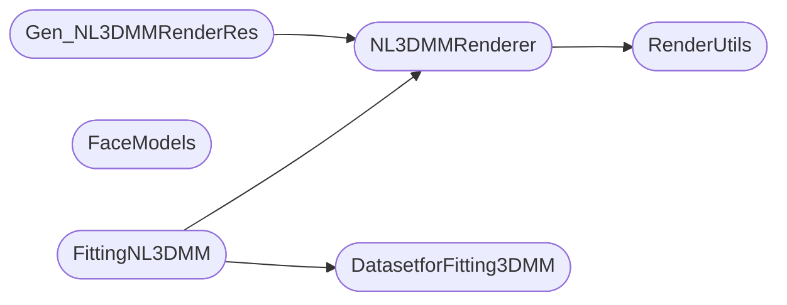

# Code Overview

[_Documentation generated by Documatic_](https://www.documatic.com)

<!---Documatic-section-Codebase Structure Python-start--->
## Codebase Structure Python

The codebase has a flat structure, with 6 code files.

<!---Documatic-block-system_architecture-start--->

<!---Documatic-block-system_architecture-end--->

# #
<!---Documatic-section-Codebase Structure Python-end--->

<!---Documatic-section-File IO-start--->
## File IO

<!---Documatic-block-file_io-start--->
The following files have file read operations

<!---Documatic-block-Fitting3DMM-start--->

	
<code>Fitting3DMM</code> (Click to Expand!)

* Fitting3DMM.DatasetforFitting3DMM
* Fitting3DMM.FaceModels: ConfigModels/nl3dmm_dict.pkl
* Fitting3DMM.Gen_NL3DMMRenderRes
* Fitting3DMM.RenderUtils

<!---Documatic-block-Fitting3DMM-end--->

The following files have file write operations

<!---Documatic-block-Fitting3DMM-start--->

	
<code>Fitting3DMM</code> (Click to Expand!)

* Fitting3DMM.FittingNL3DMM

<!---Documatic-block-Fitting3DMM-end--->
<!---Documatic-block-file_io-end--->

# #
<!---Documatic-section-File IO-end--->

<!---Documatic-section-Class Hierarchy-start--->
## Class Hierarchy

<!---Documatic-block-Dataset-start--->

	
<code>Dataset</code> (Click to Expand!)

* Fitting3DMM.DatasetforFitting3DMM.DatasetforFitting3DMM

<!---Documatic-block-Dataset-end--->

<!---Documatic-block-nn.Module-start--->

	
<code>nn.Module</code> (Click to Expand!)

* Fitting3DMM.FaceModels.Linear_3DMM
* Fitting3DMM.FaceModels.NonLinear_3DMM
* Fitting3DMM.NL3DMMRenderer.NL3DMMRenderer
* Fitting3DMM.RenderUtils.ExtractLandMarkPosition
* Fitting3DMM.RenderUtils.SoftSimpleShader

<!---Documatic-block-nn.Module-end--->

<!---Documatic-block-object-start--->

	
<code>object</code> (Click to Expand!)

* Fitting3DMM.FittingNL3DMM.FittingNL3DMM
* Fitting3DMM.Gen_NL3DMMRenderRes.GenRenderRes

<!---Documatic-block-object-end--->

# #
<!---Documatic-section-Class Hierarchy-end--->

[_Documentation generated by Documatic_](https://www.documatic.com)